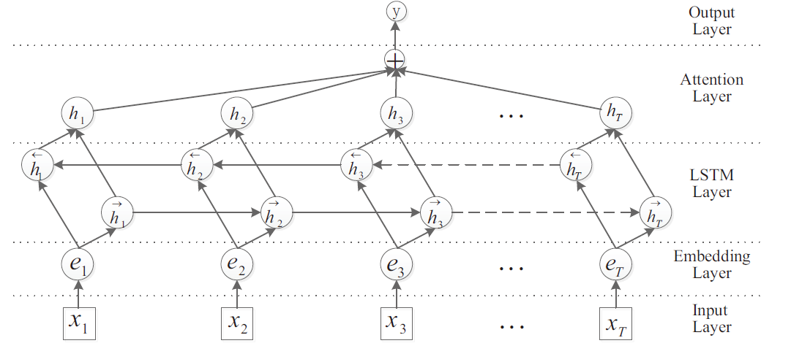
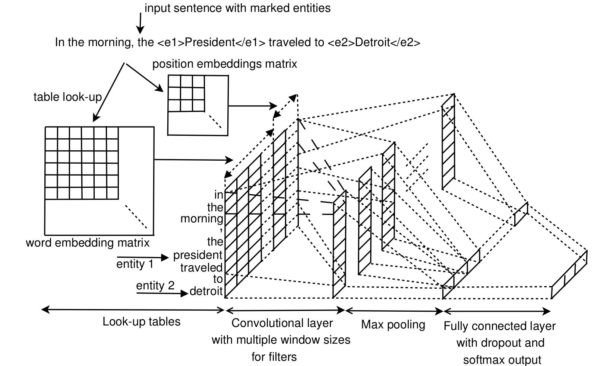

# 项目背景

# 数据概述

本次实验使用的数据集容量并不高，但也是关系抽取最常用的数据集之一，来自**SemEval-2010 Task #8**，是英文语料。

(1)一共有10种需要预测的关系，其中包括‘Other’，即没有关系；若考虑到实体匹配顺序的话则有19种。

(2)训练集中一共包含8000个句子，测试集中一共包含2717个句子

数据集具体情况如下(参考自[官方文档](https://docs.google.com/document/d/1QO_CnmvNRnYwNWu1-QCAeR5ToQYkXUqFeAJbdEhsq7w/preview))

## 数据集分布

|      Relation      |     Train Data      |      Test Data      |      Total Data      |
| :----------------: | :-----------------: | :-----------------: | :------------------: |
|    Cause-Effect    |   1,003 (12.54%)    |    328 (12.07%)     |    1331 (12.42%)     |
| Instrument-Agency  |     504 (6.30%)     |     156 (5.74%)     |     660 (6.16%)      |
|  Product-Producer  |     717 (8.96%)     |     231 (8.50%)     |     948 (8.85%)      |
| Content-Container  |     540 (6.75%)     |     192 (7.07%)     |     732 (6.83%)      |
|   Entity-Origin    |     716 (8.95%)     |     258 (9.50%)     |     974 (9.09%)      |
| Entity-Destination |    845 (10.56%)     |    292 (10.75%)     |    1137 (10.61%)     |
|  Component-Whole   |    941 (11.76%)     |    312 (11.48%)     |    1253 (11.69%)     |
| Member-Collection  |     690 (8.63%)     |     233 (8.58%)     |     923 (8.61%)      |
|   Message-Topic    |     634 (7.92%)     |     261 (9.61%)     |     895 (8.35%)      |
|       Other        |   1,410 (17.63%)    |    454 (16.71%)     |    1864 (17.39%)     |
|     **Total**      | **8,000 (100.00%)** | **2,717 (100.00%)** | **10,717 (100.00%)** |

## 实体关系含义

1. *Cause-Effect*: An event or object leads to an effect(those cancers were caused by radiation exposures)
2. *Instrument-Agency*: An agent uses an instrument(phone operator)
3. *Product-Producer*: A producer causes a product to exist (a factory manufactures suits)
4. *Content-Container*: An object is physically stored in a delineated area of space (a bottle full of honey was weighed) Hendrickx, Kim, Kozareva, Nakov, O S´ eaghdha, Pad ´ o,´ Pennacchiotti, Romano, Szpakowicz Task Overview Data Creation Competition Results and Discussion The Inventory of Semantic Relations (III)
5. *Entity-Origin*: An entity is coming or is derived from an origin, e.g., position or material (letters from foreign countries)
6. *Entity-Destination*: An entity is moving towards a destination (the boy went to bed)
7. *Component-Whole*: An object is a component of a larger whole (my apartment has a large kitchen)
8. *Member-Collection*: A member forms a nonfunctional part of a collection (there are many trees in the forest)
9. *Message-Topic*: An act of communication, written or spoken, is about a topic (the lecture was about semantics)
10. *Other*: If none of the above nine relations appears to be suitable.

# 数据预处理

## 语料关系提取

在原始语料中，每个句子包含一个实体关系，以下列方式标注出来：

```
1	"The system as described above has its greatest application in an arrayed <e1>configuration</e1> of antenna <e2>elements</e2>."
Component-Whole(e2,e1)

2	"The <e1>child</e1> was carefully wrapped and bound into the <e2>cradle</e2> by means of a cord."
Other

3	"The <e1>author</e1> of a keygen uses a <e2>disassembler</e2> to look at the raw assembly code."
Instrument-Agency(e2,e1)
```

即句子中的实体用**<e1>entity1</e1>**和**<e2>entity2</e2>**表示，在下一行附上关系类型。

因此，预处理的第一步就是要将实体、关系、原句子抽取出来。实体与句子形成三元组，存为**sentences.txt**，各句子包含的关系标签另存为**labels.txt**，**data_dir/train**子目录和**data_dir/test**子目录下各有两个。

```
pattern_normalwords = re.compile('(<e1>)|(</e1>)|(<e2>)|(</e2>)|(\'s)')
pattern_e1 = re.compile('<e1>(.*)</e1>')
pattern_e2 = re.compile('<e2>(.*)</e2>')
pattern_del = re.compile('^[!"#$%&\\\'()*+,-./:;<=>?@[\\]^_`{|}~]|[!"#$%&\\\'()*+,-./:;<=>?@[\\]^_`{|}~]$')
```

该过程主要借助这四个正则表达式。其中**pattern_e1**和**pattern_e2**用于提取实体单词，**pattern_normalwords**和**pattern_del**用于去除标注符号，重新形成正常句子。

```
def load_dataset(path_dataset):
    """加载语料数据，包括实体、关系、完整句子"""
    dataset = []
    with open(path_dataset) as f:
        piece = list()  #根据语句存储形式设置piece,一个piece就是一个<标注语句,关系,comment>的组合
        for line in f:
            line = line.strip()
            if line:
                piece.append(line)
            elif piece:
                #sentence即标注语句
                sentence = piece[0].split('\t')[1].strip('"')
                #提取出不带标注符号的两个实体
                e1 = delete_symbol(pattern_e1.findall(sentence)[0])
                e2 = delete_symbol(pattern_e2.findall(sentence)[0])
                sentence_nosymbol = list()
                #提取出不带标注符号，并且不带标点符号的原始语句
                for word in pattern_normalwords.sub('', sentence).split(' '):
                    new_word = delete_symbol(word)
                    if new_word:
                        sentence_nosymbol.append(new_word)
                #语句中包含的关系是piece的第二行
                relation = piece[1]
                #重组成<实体1,实体2,原语句,实体关系>
                dataset.append(((e1, e2, ' '.join(sentence_nosymbol)), relation))
                piece = list()
    return dataset
```

最终训练集和数据集各自生成三元组文件和标签文件，形式如下：

```
sentences.txt:
configuration	elements	The system as described above has its greatest application in an arrayed configuration of antenna elements
child	cradle	The child was carefully wrapped and bound into the cradle by means of a cord
author	disassembler	The author of a keygen uses a disassembler to look at the raw assembly code
ridge	surge	A misty ridge uprises from the surge
......
```

```
labels.txt:
Component-Whole(e2,e1)
Other
Instrument-Agency(e2,e1)
Other
Member-Collection(e1,e2)
......
```

## 生成词表

统计训练集和测试集中出现过的所有词语和关系类型标签

```
def update_vocab(txt_path, vocab):
    """从数据集中更新词表"""
    size = 0
    with open(txt_path) as f:
        for i, line in enumerate(f):
            line = line.strip()
            if line.endswith('...'):
                line = line.rstrip('...')
            word_seq = line.split('\t')[-1].split(' ')
            vocab.update(word_seq)
            size = i
    return size + 1

def update_labels(txt_path, labels):
    """从数据集中更新关系类型字典"""
    size = 0
    with open(txt_path) as f:
        for i, line in enumerate(f):
            line = line.strip()  #一行一个标签
            labels.update([line])
            size = i
    return size + 1
```

分别存储在主目录下的**words.txt**和**labels.txt**中:

```
words.txt:
"Chinese
"Muscovite"
"Polhem
"fenestration"
"till"
$13)
$20
$3.75b
......
```

```
labels.txt:
Cause-Effect(e1,e2)
Cause-Effect(e2,e1)
Component-Whole(e1,e2)
Component-Whole(e2,e1)
......
other
(19 in total)
```

并且生成词表属性存于**dataset_params.json**中：

```
dataset_params.json:
{
    "train_size": 8000,
    "test_size": 2717,
    "vocab_size": 25804,
    "num_tags": 19
}
```

## 导入词向量

本实验中使用pre-trained的词向量，存储在**./data/embeddings/vector_50d.txt**中。

首先将词表**words.txt**中的所有词映射到词向量中的对应单词，映射方式共有4种，即是否忽略字母大小写*是否忽略数字(即将所有数字字符替换为’0‘)=4，按特定优先顺序满足一种即可，否则归为OOV。一个词向量可能对应多个原单词。最终形成一个新的词向量表

```
放get_embedding_word函数加注释
```

形成映射表后，将sentences.txt中原语句的每个词编码成对应词向量idx，并通过**相关距离限制**记录每个词和实体之间的距离。

```
放load_sentences_labels头尾加注释
```

例如：

```
e1:configuration
e2:elements
sentence:The system as described above has its greatest application in an arrayed configuration of antenna elements

pos1:[39, 40, 41, 42, 43, 44, 45, 46, 47, 48, 49, 50, 51, 52, 53, 54]
pos2:[36, 37, 38, 39, 40, 41, 42, 43, 44, 45, 46, 47, 48, 49, 50, 51]
sent_idx:[21542, 21157, 1644, 6200, 518, 10038, 11559, 9642, 1437, 10899, 1197, 1594, 4881, 14834, 1320, 7277]
```

并且给出导入词向量的结果：

```
loading vocabulary from embedding file and unique words:
    First 20 OOV words:
        out_of_vocab_words[0] = "Chinese
        out_of_vocab_words[1] = "Muscovite"
        out_of_vocab_words[2] = "Polhem
        out_of_vocab_words[3] = "fenestration"
        out_of_vocab_words[4] = "till"
        out_of_vocab_words[5] = $13)
        out_of_vocab_words[6] = $20
        out_of_vocab_words[7] = $3.75b
        out_of_vocab_words[8] = '00
        out_of_vocab_words[9] = 'Ab
        out_of_vocab_words[10] = -
        out_of_vocab_words[11] = --40
        out_of_vocab_words[12] = 0.0025
        out_of_vocab_words[13] = 0.005
        out_of_vocab_words[14] = 0.01
        out_of_vocab_words[15] = 0.1
        out_of_vocab_words[16] = 0.10
        out_of_vocab_words[17] = 0.2
        out_of_vocab_words[18] = 0.2%
        out_of_vocab_words[19] = 0.25
        out_of_vocab_words[20] = 08:07
        out_of_vocab_words[21] = 08:30
 -- len(out_of_vocab_words) = 1846
 -- original_words_num = 18010
 -- lowercase_words_num = 5948
 -- zero_digits_replaced_num = 0
 -- zero_digits_replaced_lowercase_num = 0
```

# 模型训练

## 参考模型

本实验共实现了三种常见的关系抽取模型：1. BiLSTM+Attention, 2.BiLSTM+RNN, 3.CNN，分别参考自论文[[1]](https://www.aclweb.org/anthology/P16-2034/),[[2]](https://arxiv.org/abs/1508.01006),[[3]](http://www.cs.nyu.edu/~thien/pubs/vector15.pdf)

model1, **BiLSTM+Attention**:



model2, **BiLSTM+RNN**:


model3, **CNN**:



## 参数设置

```
    "max_len": 98,
    "pos_dis_limit": 50,

    "word_emb_dim": 50,
    "pos_emb_dim": 10,
    "hidden_dim": 100,

    "filters": [2,3,4,5],
    "filter_num": 128,

    "optim_method": "adadelta",
    "learning_rate": 0.001,
    "weight_decay": 1e-5,
    "clip_grad": 5,

    "dropout_ratio": 0.5,
    "batch_size": 64,
    "epoch_num": 100,

    "min_epoch_num": 20,
    "patience": 0.02,
    "patience_num": 50
```

这些参数是三个模型通用的，可以在**./base_model/params.json**中调整

# 评估结果

基于上述参数设置，最终评估结果如下：

|                       | **Pre.**  | **Re.**   | **F1.**   |
| --------------------- | --------- | --------- | --------- |
| **BiLSTM+att**        | **78.90** | **81.76** | **80.31** |
| **BiLSTM+MaxPooling** | **79.03** | **73.94** | **76.40** |
| **CNN**               | **80.61** | **86.77** | **83.57** |

